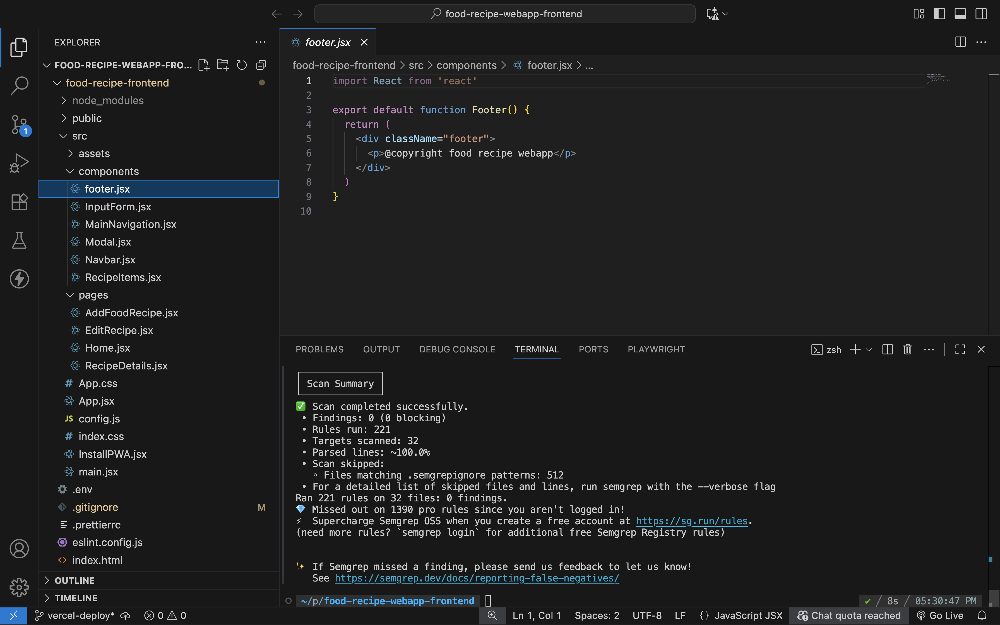
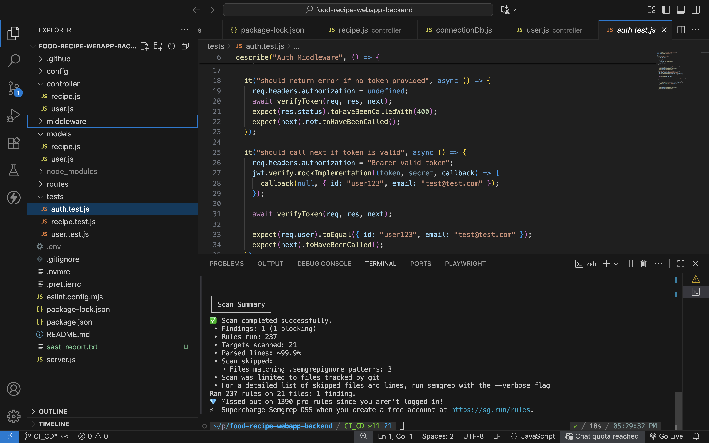
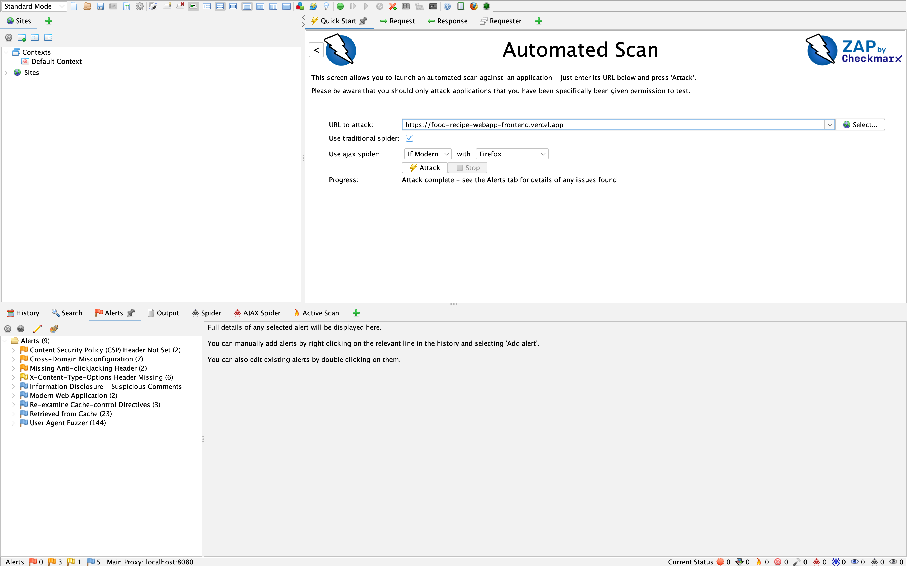
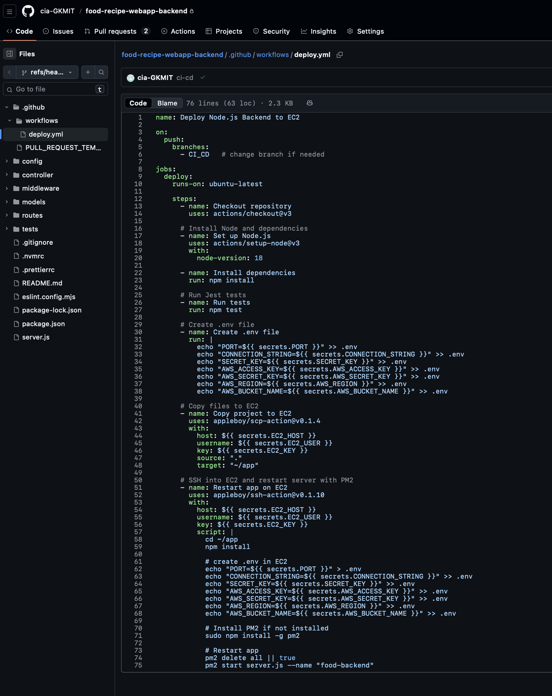
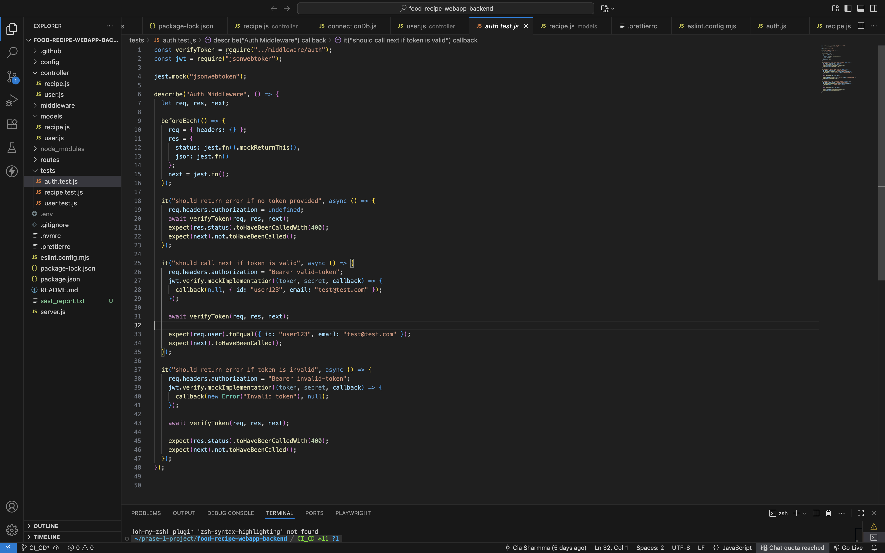
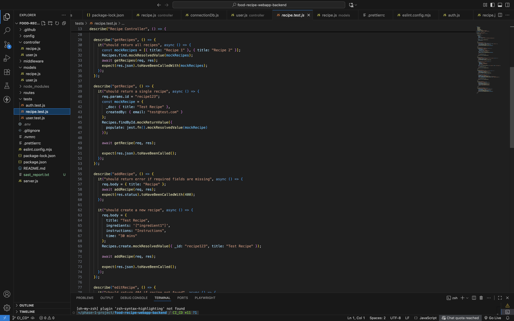
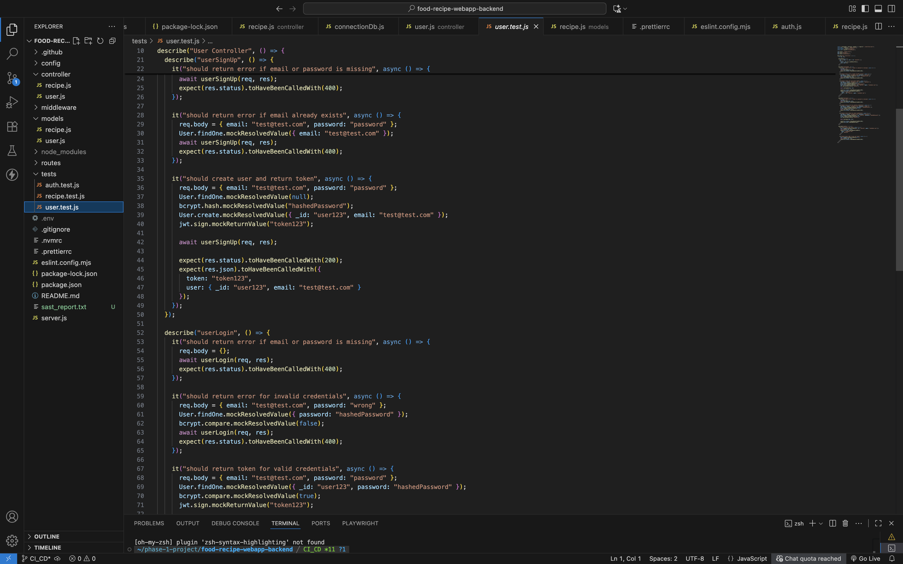

# CI/CD Pipeline

## SAST (Static Application Security Testing)
SAST analyzes the application source code to detect security vulnerabilities during development. Semgrep is used for both the frontend and backend to identify insecure patterns and dependency risks before deployment.

### SAST for Frontend (Semgrep)

### SAST for Backend (Semgrep)

---

## DAST (Dynamic Application Security Testing)
DAST performs security testing on the live application to detect runtime vulnerabilities. It scans deployed endpoints to identify issues such as authentication weaknesses, injection risks, and server misconfigurations.

### DAST Screenshot

---

## CI/CD Pipeline Overview
The CI/CD pipeline automates the workflow of building, testing, scanning, and deploying the application. It runs on every push and pull request to ensure code quality, security checks, and smooth deployment. The pipeline is implemented using GitHub Actions.

### CI/CD Pipeline Screenshot
A screenshot of the pipeline execution showing automated steps and deployment status.

---

## Automated Testcases
Automated testcases validate the core functionality of the application before deployment. Unit tests are executed using Jest, and results are evaluated for reliability and stability.

### Testcase Screenshots
  
  

