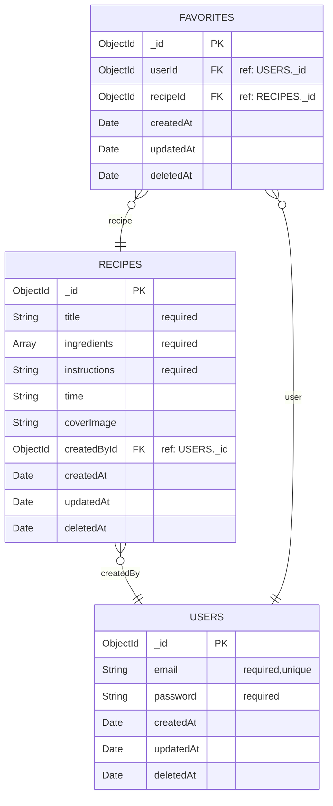

## Database Schema

This section documents the database schema exactly as implemented in the project’s model files.  
The database uses **MongoDB** with **Mongoose**, and all models include `{ timestamps: true }`  
to automatically add `createdAt`, `updatedAt` and `deletedAt` fields.

---

### 1. Overview

The Food Recipe Web App database consists of three main collections:

| Collection | Description |
|-------------|--------------|
| **Favourites** | Authorised user can customise their recipes what they like |
| **Users** | Regular users who create, update, and manage recipes |
| **Recipes** | Stores recipe details and links to their creators |
<!-- 
Each collection is connected through **ObjectId references**, creating logical relationships (similar to SQL joins). -->

---

### 2. Collections and Fields

### 🧩 Admin Collection

| Field | Type | Description |
|--------|------|-------------|
| `email` | String | Unique admin email |
| `password` | String | Hashed password |
| `createdAt` | Date | Added automatically by timestamps |
| `updatedAt` | Date | Added automatically by timestamps |
| `deletedAt` | Date | Added automatically by timestamps |

### Example Document

```json
{
  "_id": "673013a91234567890abcd11",
  "email": "admin@example.com",
  "password": "$2b$10$abc123hashedpassword",
  "createdAt": "2025-11-10T09:45:00Z",
  "updatedAt": "2025-11-10T09:45:00Z",
  "deletedAt": "2025-11-10T09:45:00Z"
}

```

---

### 3. Database-Diagram



###  Compound Index (Title + CreatedBy)

To prevent duplicate recipe titles for the same user, a **compound unique index** is added:

```js
recipeSchema.index({ title: 1, createdBy: 1 }, { unique: true });
```