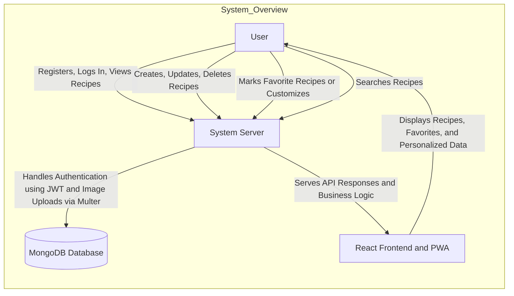
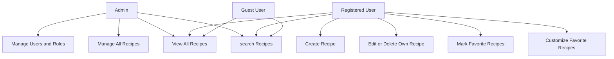

# Food Recipe Web App — Functional Document

## Overview

This document covers the main features, requirements, and data flow of my **Food Recipe Web App**.  
It’s a full-stack **MERN** application that lets users register, log in, and manage their own recipes with image uploads.  
I’m also adding **PWA (Progressive Web App)** support so it can work smoothly on mobile phones too.

---

## Project Purpose
The Food Recipe Web App provides an online platform for users to create, manage, and share their cooking recipes.  
It solves the real-world problem of disorganized recipe storage and lack of personalization in existing platforms like YouTube or Pinterest.

---

## Core Features

| Feature | Description | Type |
|----------|--------------|------|
| User Registration/Login | Users can register and log in to manage their recipes. Passwords are stored securely using hashing. | Functional |
| Authentication (JWT) | Authenticated routes protect recipe creation, updates, and deletion. | Functional |
| Recipe CRUD Operations | Users can create, view, edit, and delete recipes. | Functional |
| Image Upload | Each recipe supports an image file (handled using Multer). | Functional |
| Recipe Listing | Users can browse all available recipes. | Functional |
| Recipe Details | Users can view full recipe details like ingredients, steps, and image. | Functional |
| Access Control | Only the recipe owner can edit or delete their own recipes. | Non-Functional |
| Favorite Recipes | Users can mark their favorite recipes and view them separately on a personalized “Favorites” page. | Functional |
| Responsive Frontend | Built using React and Vite for a clean, user-friendly interface. | Non-Functional |
| PWA (Progressive Web App) | Allows the app to be installed and accessed from mobile devices with offline support. | Non-Functional |

---
## System Overview

## System Requirements

## Functional Requirements 

### FR-01: User Registration
- **Description:** Users can register using name, email, and password.  
- **Inputs:** Name, Email, Password  
- **Process:** Validate → Hash password (bcrypt) → Save in MongoDB.  
- **Output:** Redirect to login with success message.  
- **Errors:** Duplicate email, missing fields.

---

### FR-02: User Login
- **Description:** Authenticate users and generate JWT token for access.  
- **Inputs:** Email, Password  
- **Process:** Verify credentials → Issue JWT token.  
- **Output:** Redirect to dashboard/homepage.  
- **Errors:** Invalid credentials.

---

### FR-03: Authentication & Authorization
- **Description:** Protect private routes and allow only authorized access.  
- **Inputs:** JWT token  
- **Process:** Validate token before processing requests.  
- **Output:** Access granted to protected features.  
- **Errors:** Token invalid, missing, or expired.

---

### FR-04: Create Recipe
- **Description:** Authenticated users can add recipes with optional images.  
- **Inputs:** Recipe data (title, ingredients, steps, image)  
- **Process:** Validate → Upload image via Multer → Store in MongoDB.  
- **Output:** Recipe created successfully.  
- **Errors:** Missing fields or invalid image.

---

### FR-05: View Recipes
- **Description:** Display all available recipes with title, image, and author.  
- **Inputs:** —  
- **Process:** Fetch recipes via API.  
- **Output:** Recipe list shown in UI.  
- **Errors:** No data or API error.

---

### FR-06: Edit Recipe
- **Description:** Recipe owners can edit their own recipes.  
- **Inputs:** Recipe ID, updated fields  
- **Process:** Verify ownership → Update database.  
- **Output:** Updated recipe displayed.  
- **Errors:** Unauthorized access or invalid ID.

---

### FR-07: Delete Recipe
- **Description:** Allow users to delete their recipes.  
- **Inputs:** Recipe ID  
- **Process:** Verify ownership → Delete record.  
- **Output:** Confirmation message shown.  
- **Errors:** Unauthorized user or invalid ID.

---

### FR-08: Favorite Recipes
- **Description:** Users can mark/unmark favorite recipes.  
- **Inputs:** Recipe ID, User ID  
- **Process:** Toggle favorite status in DB.  
- **Output:** Favorites list updated.  
- **Errors:** Database write error.

---

### FR-09: Progressive Web App (PWA)
- **Description:** Enable app install and offline access.  
- **Inputs:** —  
- **Process:** Register service worker and cache assets.  
- **Output:** App usable offline.  
- **Errors:** Cache failure or sync delay.

---

### FR-10: Searching Recipes
- **Description:** Allows users to search for recipes by name or title.
- **Inputs:**  Recipe name or title (string).
- **Process:** User enters a keyword; the system searches stored recipe titles for matches.
- **Output:** List of matching recipes with title, image, ingredients, and time.
- **Errors:** 400 (missing input), 404 (no matches found).

## Non-Functional Requirements

### NFR-01: Security
- Passwords must be securely hashed before storing in the database.  
- JWT tokens are used for authentication and route protection.  
- User data should not be exposed in plain text.

---

### NFR-02: Responsiveness
- Frontend interface should adjust and display properly across different screen sizes and devices.  
- Maintain a consistent layout for both desktop and mobile views.

---

### NFR-03: Data Handling
- Images should be uploaded and stored efficiently without affecting app performance.  
- API endpoints should return structured JSON responses following RESTful conventions.

---

### NFR-04: Offline Support
- The app should provide offline access for key pages and features.  
- Use Progressive Web App (PWA) behavior to make it installable and usable without constant internet.

---

### NFR-05: Maintainability
- Codebase should remain simple and easy to modify.  
- Follow a clear folder structure separating frontend, backend, and database components.

---

### Technical Requirements

| Component | Technology | Purpose |
|------------|-------------|----------|
| Frontend | React + Vite | Build fast, modern, responsive UI |
| Backend | Node.js + Express.js | Handle APIs and business logic |
| Database | MongoDB | Store user and recipe data |
| Authentication | JWT | Manage secure access |
| File Uploads | Multer | Handle recipe images |
| Password Encryption   | bcrypt | Hash and secure passwords |
| PWA | Service Worker  | Enable offline and mobile use |

---

## User-roles

