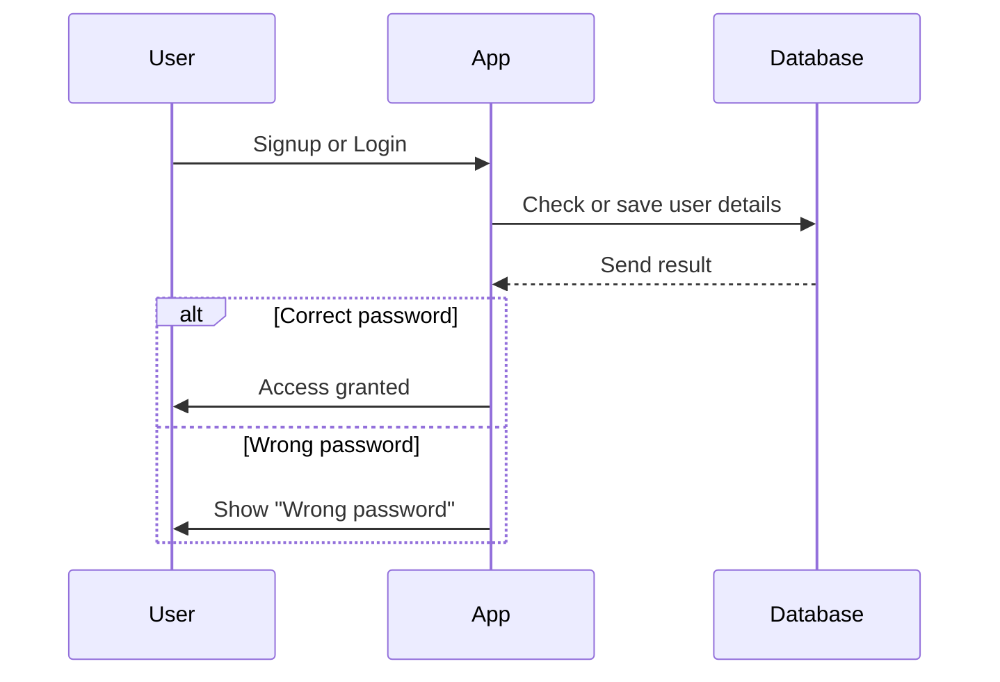

# System Architecture & Data Flow

This section explains the overall system setup and internal data movement in the project.

---

### Explanation
- **Route 53**: Provides the custom domain and DNS routing for the application.  
- **EC2 Instance**: Hosts the Node.js + Express backend service that manages API requests and business logic.  
- **S3 Bucket**:  
  - Serves static frontend files built from React + Vite.  
  - Stores uploaded recipe images and other media assets.  
- **MongoDB Atlas**: Cloud-hosted NoSQL database used to persist user accounts, recipes, and favorites.  
- **Security**:  
  - All API calls are served over HTTPS through Route 53-managed SSL.  
  - JWT tokens secure authentication across sessions.

This setup ensures high availability, scalability, and separation of concerns between static hosting, compute, and storage.

---

## AWS Deployment Architecture

Below is the structure showing how the application is deployed using AWS services.

---

## Data Flow Diagram (DFD)

The DFD illustrates how data moves across the system — from users to the database and backend processes.

> *Note: This is a simplified Level-1 DFD representing the major data movement.*

### Explanation
1. **User Interaction** – A user accesses the application through a browser or installed PWA.  
2. **Frontend Request** – The React interface communicates with the backend via REST APIs.  
3. **Backend Processing** – The Node.js + Express server validates inputs, handles business logic, and manages authentication.  
4. **Database Operations** – MongoDB Atlas stores or retrieves recipe and user data as requested.  
5. **Response Delivery** – The backend sends structured JSON responses to the frontend, which updates the UI accordingly.

---

## Login Process — Sequence Diagram

This diagram represents the login and signup process in a compact, visual form.

# API Reference

This table lists all API endpoints currently implemented (or recommended) in the **Food Recipe Web App**.  
The routes are grouped by functional modules: **Auth/User**, **Recipes**, **Static Assets**, and **Favorites**.

---

## Auth / User

| **Method** | **Path** | **Auth** | **Request (body / params / query)** | **Notes** |
|:-----------:|:---------:|:--------:|:------------------------------------:|:-----------:|
| **POST** | `/signUp` | No | JSON `{ "email", "password" }` | Registers a new user |
| **POST** | `/login` | No | JSON `{ "email", "password": }` | Authenticates user and  |
| **GET** | `/user/:id` | No | Path param: user ID | Returns `{ email}`. |

---

## Recipes

| **Method** | **Path** | **Auth** | **Request (body / params / query)** | **Notes** |
|:-----------:|:---------:|:--------:|:------------------------------------:|:-----------:|
| **GET** | `/recipe/` | No | — | Returns `[ recipe, recipe]`; each recipe includes model fields  |
| **GET** | `/recipe/:id` | No | Path param: recipe ID | Returns a single recipe object. |
| **POST** | `/recipe/` | Yes | multipart/form-data `{ ex file, title}` | Creates a new recipe. Multer saves file to `backend/public/images` . |
| **PUT** | `/recipe/:id` | Optional | multipart/form-data or JSON | Updates an existing recipe.  |
| **DELETE** | `/recipe/:id` | Optional | Path param: recipe ID | Deletes recipe.  |

---

## Static Assets

| **Method** | **Path** | **Auth** | **Request (body / params / query)** | **Notes** |
|:-----------:|:---------:|:--------:|:------------------------------------:|:-----------:|
| **GET** | `/images/:filename` | No | Path param: filename | Serves static images from `backend/public/images/`. Use in frontend as `http://<host>/images/<coverImage>`. |

---

## Favorites (Server-Side Persistence)

| **Method** | **Path** | **Auth** | **Request (body / params / query)** | **Notes** |
|:-----------:|:---------:|:--------:|:------------------------------------:|:-----------:|
| **POST** | `/favorite` | Yes | JSON `{ "recipeId": "<id>" }` | Creates a favorite document . |
| **DELETE** | `/favorite/:recipeId` | Yes | Path param: recipeId | Removes favorite for the current user. |
| **GET** | `/favorite/me` | Yes | — | Returns `[ favorite doc (populated with recipe) ]`. |
| **POST** | `/favorite/migrate` | Yes | JSON `{ "recipeIds" }` | Migrates localStorage favorites to DB on login. |

## Notes

- **Image Handling:** Managed by **Multer**; stored in `backend/public/images`.  
- **Authentication:** Uses **JWT**. Include token in header:  

---

# Testing Frameworks

The project follows a minimal and efficient testing approach focusing on verifying key logic and API endpoints.  
This setup uses **Jest** for automated testing and **Postman** for manual API validation.

| **Testing Area** | **Framework / Tool** | **Purpose** | **Type of Testing** | **Execution Mode** |
|:--|:--|:--|:--|:--|
| **Backend & Frontend Logic** | **Jest** | Validate backend controllers, database operations, and utility functions. | Unit / Integration | Automated |
| **API Endpoints** | **Postman** | Verify API routes such as `/login`, `/signUp`, `/recipe`, and `/favorite`. | Functional / Manual | Manual runs using Postman GUI |

---

# Tech Stack

The **Food Recipe Web App** is a full-stack MERN (MongoDB, Express.js, React, Node.js) project designed for recipe management, authentication, and image handling.  
The table below lists all major technologies and their specific roles.

---

| **Layer** | **Technology / Service** | **Purpose** | **Category** |
|:--|:--|:--|:--|
| **Frontend** | **React.js + Vite** | Build fast, responsive, and modular user interfaces. | Framework |
|  | **PWA (Progressive Web App)** | Enable offline use and “Add to Home Screen” functionality. | Enhancement |
| **Backend** | **Node.js** | Runtime environment for server-side logic. | Runtime |
|  | **Express.js** | Lightweight web framework to manage routes and APIs. | Framework |
|  | **Multer** | Handle file uploads (recipe images). | Middleware |
|  | **bcrypt** | Secure password hashing before storage. | Security |
|  | **JWT (JSON Web Token)** | User authentication and authorization. | Security |
| **Database** | **MongoDB Atlas** | Store user data, recipes, and favorites in the cloud. | Database |
| **Cloud & Deployment** | **AWS EC2** | Host backend server and APIs. | Cloud Compute |
|  | **AWS S3** | Store uploaded images securely and serve them globally. | Cloud Storage |
|  | **AWS Route 53** | Manage custom domain and DNS routing. | Cloud DNS |
|  | **GitHub Pages** | Deploy documentation and static assets. | Hosting |
| **Testing & Validation** | **Jest** | Unit and integration testing for logic validation. | Testing |
|  | **Postman** | Manual API testing and verification. | Testing |
| **Version Control** | **Git & GitHub** | Track versions and collaborate on code. | DevOps |

---